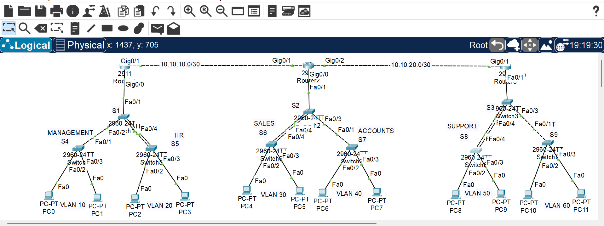

# Vertex Builders — Enterprise Network Infrastructure & Security

A self-designed Cisco Packet Tracer simulation of an enterprise network for a fictional construction company, **Vertex Builders**.

The project demonstrates enterprise network segmentation, inter-VLAN routing, inter-site connectivity, link aggregation, automated IP addressing, remote management, and Layer 2 security.

**Project Type:** Self-designed network simulation  
**Platform:** Cisco Packet Tracer  
**Scenario:** Fictional construction company  
**Purpose:** Networking and cybersecurity practice

---

## Network Overview

The simulated organization consists of three locations:

- Headquarters (HQ)
- Branch Office 1 (B-1)
- Branch Office 2 (B-2)

The network uses VLAN segmentation at each location and point-to-point router links between sites.

## Network Architecture

### Headquarters

- VLAN 10 — Management
- VLAN 20 — HR

### Branch Office 1

- VLAN 30
- VLAN 40

### Branch Office 2

- VLAN 50
- VLAN 60

---

## VLAN & IP Addressing

| Location | VLAN | Network | Default Gateway |
|---|---:|---|---|
| HQ | 10 | 192.168.10.0/24 | 192.168.10.1 |
| HQ | 20 | 192.168.20.0/24 | 192.168.20.1 |
| B-1 | 30 | 192.168.30.0/24 | 192.168.30.1 |
| B-1 | 40 | 192.168.40.0/24 | 192.168.40.1 |
| B-2 | 50 | 192.168.50.0/24 | 192.168.50.1 |
| B-2 | 60 | 192.168.60.0/24 | 192.168.60.1 |

### Inter-Router Links

| Link | Network | IP Addresses |
|---|---|---|
| HQ ↔ B-1 | 10.10.10.0/30 | HQ: 10.10.10.1 / B-1: 10.10.10.2 |
| B-1 ↔ B-2 | 10.10.20.0/30 | B-1: 10.10.20.1 / B-2: 10.10.20.2 |

---

## Technologies Implemented

### Layer 2 Networking

- VLAN segmentation
- Access ports
- IEEE 802.1Q trunking
- PAgP EtherChannel
- LACP EtherChannel
- Static EtherChannel

### Layer 3 Networking

- Router-on-a-Stick
- Inter-VLAN routing
- Point-to-point router links
- Static routing

### Network Services

- DHCP
- DNS configuration
- Telnet remote management

### Security Controls

- Switch Port Security
- Sticky MAC address learning
- Maximum MAC address limitation
- Shutdown violation mode

---

## VLAN Segmentation

VLANs were used to logically separate network traffic into different broadcast domains.

The VLAN structure is:

| VLAN | Network | Gateway |
|---:|---|---|
| 10 | 192.168.10.0/24 | 192.168.10.1 |
| 20 | 192.168.20.0/24 | 192.168.20.1 |
| 30 | 192.168.30.0/24 | 192.168.30.1 |
| 40 | 192.168.40.0/24 | 192.168.40.1 |
| 50 | 192.168.50.0/24 | 192.168.50.1 |
| 60 | 192.168.60.0/24 | 192.168.60.1 |

---

## Trunking

IEEE 802.1Q trunking was configured between infrastructure devices to carry multiple VLANs across a single physical link.

Verification command:

`show interfaces trunk`

### Key Concept

**Access Port → Carries traffic for one VLAN**

**Trunk Port → Carries traffic for multiple VLANs**

---

## EtherChannel

Three EtherChannel methods were implemented to understand different link aggregation mechanisms.

### PAgP

PAgP was used for dynamically negotiated EtherChannel formation.

Modes practiced:

- Desirable
- Auto

### LACP

LACP was used for standards-based EtherChannel negotiation.

Modes practiced:

- Active
- Passive

### Static EtherChannel

Static EtherChannel was configured using `channel-group <number> mode on`.

The resulting Port-Channel was configured as a trunk where required.

Verification command:

`show etherchannel summary`

A successfully bundled interface is identified by the `P` flag.

---

## Router-on-a-Stick

Router-on-a-Stick was implemented to provide inter-VLAN routing using router subinterfaces.

| Subinterface | VLAN | Gateway |
|---|---:|---|
| G0/0.10 | 10 | 192.168.10.1 |
| G0/0.20 | 20 | 192.168.20.1 |
| G0/0.30 | 30 | 192.168.30.1 |
| G0/0.40 | 40 | 192.168.40.1 |
| G0/0.50 | 50 | 192.168.50.1 |
| G0/0.60 | 60 | 192.168.60.1 |

### Memory Rule

**Subinterface number = VLAN number**

For example:

`G0/0.10` → VLAN 10

`G0/0.20` → VLAN 20

---

## Inter-Site Routing

The three routers are connected using point-to-point `/30` networks.

### HQ ↔ B-1

**Network:** `10.10.10.0/30`

- HQ: `10.10.10.1`
- B-1: `10.10.10.2`

### B-1 ↔ B-2

**Network:** `10.10.20.0/30`

- B-1: `10.10.20.1`
- B-2: `10.10.20.2`

Static routes were configured to provide connectivity between remote VLAN networks.

### Routing Principle

**Destination Network → Next-Hop Router**

Verification command:

`show ip route`

---

## DHCP

DHCP was configured on the routers for all VLANs.

The first 20 IP addresses of each subnet were excluded from DHCP allocation to reserve them for infrastructure and static assignments.

Example:

- `.1 – .20` → Reserved
- `.21+` → DHCP clients

Configured DNS server:

`8.8.8.8`

DHCP operation was verified using:

`show ip dhcp binding`

A client successfully received a dynamically assigned address from the configured DHCP pool.

---

## Telnet Remote Management

Telnet was configured on the routers using Cisco IOS VTY lines.

The configuration provides remote CLI access from reachable network devices.

Telnet connectivity was successfully tested against:

- HQ
- B-1
- B-2

---

## Port Security

Port Security was implemented on PC-facing access ports.

The security configuration uses:

- Maximum MAC addresses: 1
- Sticky MAC learning
- Violation mode: Shutdown

### Security Logic

**Port Security**  
Enables Layer 2 port security.

**Maximum 1**  
Allows only one MAC address on the secured port.

**Sticky MAC**  
Learns the connected device MAC address and adds it as a secure MAC address.

**Shutdown**  
A security violation causes the port to enter a shutdown or error-disabled state.

### Verification

`show port-security`

`show port-security interface <interface>`

`show port-security address`

Successful verification showed:

- Maximum secure MAC addresses: 1
- Current secure MAC addresses: 1
- Security violations: 0

---

## Verification & Testing

The completed network was verified using Cisco IOS commands and end-to-end connectivity tests.

| Function | Verification Command |
|---|---|
| VLANs | `show vlan brief` |
| Trunks | `show interfaces trunk` |
| EtherChannel | `show etherchannel summary` |
| Neighbor Discovery | `show cdp neighbors` |
| Interfaces | `show ip interface brief` |
| Routing | `show ip route` |
| DHCP | `show ip dhcp binding` |
| Port Security | `show port-security` |
| Port Security Details | `show port-security interface <interface>` |
| Secure MAC Addresses | `show port-security address` |

### Connectivity Testing

ICMP ping tests were performed to verify:

- Default gateway connectivity
- Inter-VLAN connectivity
- Inter-router connectivity
- Remote VLAN connectivity

DHCP and Telnet functionality were also successfully tested.

---

## Troubleshooting Experience

During implementation, several configuration issues were identified and resolved.

### Trunk Encapsulation

When trunk mode could not be enabled because the encapsulation was set to Auto, 802.1Q encapsulation was configured explicitly before enabling trunk mode.

### Router Interface Status

Router subinterfaces depend on the physical interface being operational.

The physical interface was enabled using:

`no shutdown`

### Static Routing

Routes were designed by identifying:

**Destination Network → Next-Hop Router**

### EtherChannel

PAgP and LACP determine how physical links are negotiated and bundled.

Trunking determines what VLAN traffic the resulting link carries.

**EtherChannel and trunking are separate concepts that can be used together.**

### Port Security

Port Security was applied to PC-facing access ports rather than infrastructure trunks or EtherChannel links.

---

## Key Learning Outcomes

This project provided hands-on experience with:

- Enterprise VLAN segmentation
- 802.1Q trunking
- PAgP EtherChannel
- LACP EtherChannel
- Static EtherChannel
- Router-on-a-Stick
- Inter-VLAN routing
- Point-to-point router connectivity
- Static route design
- DHCP deployment
- DNS configuration
- Telnet remote management
- Layer 2 access-port security
- Cisco IOS troubleshooting
- Network verification and testing

---

## Project Files

The repository contains:

- Cisco Packet Tracer topology
- Network topology diagram
- Technical configuration notes
- Project documentation

### Main Project File

`Vertex-Builders-Enterprise-Network.pkt`

---

## Disclaimer

Vertex Builders is a fictional organization created specifically for this networking simulation.

This project was independently designed and implemented for educational and portfolio purposes. It does not represent work performed for an actual client or organization.

---

## Tools

- Cisco Packet Tracer
- Cisco IOS CLI
